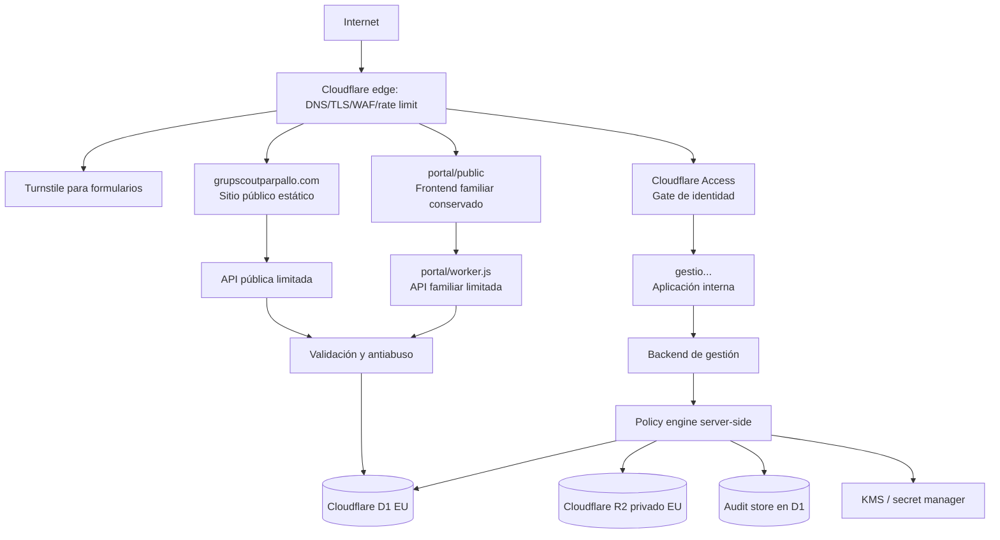

# Propuesta de arquitectura segura

Estado: **TARGET PLATFORM APPROVED — NO REMOTE RESOURCES CREATED — NOT PRODUCTION READY**

Actualización 2026-09-24 (consolidación local/sintética): `portal/public/` conserva la UI familiar existente y `portal/worker.js` conecta catálogo e inscripción con los servicios 3A en `gestio/src/services/`, D1 y la abstracción de storage/outbox. `family/` queda **DEPRECATED / CANDIDATE_FOR_REMOVAL**, sin borrado. `gestio/` sigue siendo la interfaz interna. Actividades nuevas no usan Sheets, Drive ni `data/activitats.json`; cuota anual sigue en su flujo legacy. `EVIDENCE_STORAGE` usa R2 emulado local; el futuro bucket exige jurisdicción `eu`, privado, y no se ha provisionado. El restore D1 no respalda los binarios. Access/MFA, Turnstile, antivirus/cuarentena, email real, IAM, cifrado, retención y restore de objetos siguen pendientes. [Evidencia 3A](PHASE_3A_REPORT.md).

Actualización 2026-09-26 (FASE 3B local/sintética): el flujo canónico de **cuotas nuevas** también pasa por `portal/worker.js` a servicios 3B en `gestio/`, D1, abstracción de objetos emulada y outbox ficticio. Obligación, transferencia y asignación son entidades distintas; el descuento usa agrupación familiar explícita. El backend legacy de cuota queda en código para inventario, pero el portal no lo invoca. `gestio/` incorpora operaciones y métricas básicas sin rediseño. El Apps Script remoto antiguo no se ha consultado: **PRODUCTION_BLOCKER / MIGRATION_CHECK**. No se ha creado recurso remoto ni usado dato real; [evidencia 3B](PHASE_3B_REPORT.md). El párrafo anterior describe el estado histórico 3A, no el flujo actual de cuota.

Implementación parcial FASE 1: `gestio/` ya materializa el Worker local, D1 local, sesiones y policy engine; la topología externa del diagrama sigue siendo objetivo, no despliegue verificado. Véase [informe FASE 1](PHASE_1_REPORT.md).

Alcance: únicamente la infraestructura nueva de este repositorio. La web antigua actualmente publicada queda fuera. En esta propuesta, **web pública** designa la nueva superficie `site/`.

## 1. Decisión arquitectónica

Conservar la web pública y crear dos fronteras independientes:

1. el Worker `portal/` con su frontend conservado, como único canal familiar de envío y sin capacidades generales de lectura;
2. una aplicación interna `gestio` con identidad individual, autorización backend y persistencia relacional.

Google Sheets/Drive puede mantenerse como adaptador transitorio, pero no como núcleo de permisos de la nueva plataforma.

La plataforma objetivo de la primera versión queda fijada por [ADR-001](adr/ADR-001-cloudflare-first-eu.md): Cloudflare D1 y R2 con jurisdicción `eu`, Workers/Static Assets, Access y Turnstile. La selección tecnológica está aprobada; la configuración remota, los contratos y el uso de datos reales siguen pendientes.

## 2. Topología objetivo



## 3. Superficies

### Web pública

- Contenido institucional y formularios mínimos.
- Sin cookies de autenticación interna.
- Sin datos privados, búsquedas, listados o endpoints de administración.
- Formularios con schemas server-side, Turnstile validado en servidor, límites, WAF/rate limiting y mensajes no enumerables.

### Portal familiar

- Principalmente envío y confirmación genérica.
- La clave compartida actual solo puede sobrevivir como filtro temporal de acceso casual.
- Si en el futuro se permite consultar o corregir un envío, deberá existir un grant de recurso: token de un solo propósito, alta entropía, corto, revocable y ligado a una inscripción/familia concreta. Nunca un listado general.
- Un ID aleatorio no sustituye autorización.

### Portal interno

- Solo tras Cloudflare Access y autenticación individual con MFA.
- El backend vuelve a verificar identidad y autorización en cada operación.
- No hay rol universal `ADMIN` con acceso a todo.
- La UI refleja permisos, pero no es una barrera de seguridad.

## 4. Trust boundaries

| Frontera | No se confía en | Control mínimo |
|---|---|---|
| Navegador → edge | payload, rol, IDs, origen declarado | TLS, WAF, límites, validación |
| Edge → aplicación | cabeceras falsificables si el origen es directo | Tunnel/origin lock + validación JWT Access |
| Aplicación → policy engine | decisiones dispersas en controladores | autorización centralizada y fail-closed |
| Aplicación → datos | consultas demasiado amplias | repositorios por dominio y filtros obligatorios |
| Aplicación → objetos | nombre/MIME del cliente | cuarentena, magic bytes, escaneo, IDs generados |
| Operador → producción | error humano/BYOD | MFA, mínimo privilegio, reauth, auditoría |
| Backup → restore | copia corrupta o expuesta | cifrado, acceso separado, restore test |

## 5. Autenticación

1. Un IdP compatible autentica cuentas individuales y exige MFA.
2. Cloudflare Access decide si la identidad puede alcanzar `gestio`.
3. El backend valida criptográficamente `Cf-Access-Jwt-Assertion`, incluidos firma, `iss`, `aud`, `exp` y tipo.
4. El `sub` del IdP se mapea a `auth_identity`; el email no será la clave primaria.
5. Se crea una sesión de aplicación server-side revocable, con cookie opaca `__Host-`, `Secure`, `HttpOnly` y `SameSite` apropiado.
6. Cada request comprueba estado de cuenta, sesión y autorización.

Cloudflare documenta que el JWT debe validarse en el origen y que el header por sí solo no es prueba suficiente: <https://developers.cloudflare.com/cloudflare-one/access-controls/applications/http-apps/authorization-cookie/validating-json/>.

Parámetros iniciales provisionales:

- idle timeout: 30 minutos;
- duración absoluta: 8 horas;
- reautenticación para salud, exportaciones, cambios de permisos y break-glass;
- revocación inmediata por usuario, sesión o incidente.

Son **PROVISIONAL** y deben ajustarse operativamente.

## 6. Autorización

Modelo híbrido:

```text
identidad activa
+ rol diferenciado
+ permiso explícito
+ scope de sección
+ recurso y acción
+ purpose/temporalidad cuando aplique
+ grant específico para salud
- denegaciones y estado suspendido
= decisión ALLOW/DENY registrada
```

El diseño detallado está en `AUTHORIZATION_MODEL.md`.

## 7. Datos y servicios

- Cloudflare D1 con jurisdicción `eu`, semántica SQLite, transacciones compatibles, constraints e historial de migraciones versionado.
- Módulos/repositorios separados para identidad, administración, salud, economía y auditoría.
- Cloudflare R2 Standard privado con jurisdicción `eu` para justificantes y documentos; acceso mediante backend o URLs firmadas de muy corta duración.
- Audit store append-only lógico en D1, con integridad y acceso separado a nivel de aplicación.
- Jobs de retención/bloqueo/supresión por categoría.
- Outbox transaccional para correo y tareas asíncronas, evitando que un fallo de email cambie el resultado de la transacción principal.

## 8. Cifrado

### En tránsito y reposo

- TLS obligatorio entre todas las capas.
- Cifrado administrado por proveedor para DB, objetos, snapshots y backups.
- Claves y secretos separados por entorno.

### Cifrado de campos sensibles

Propuesta para evaluación, no implementación inmediata:

- AES-256-GCM con nonce único y AAD que incluya entidad, campo, versión y tenant/grupo;
- envelope encryption: DEK por registro o conjunto pequeño, envuelta por una KEK en KMS;
- el frontend nunca recibe claves;
- rotación de KEK mediante rewrap, y versión de clave guardada junto al ciphertext;
- búsquedas sobre campos cifrados deshabilitadas por defecto; si alguna es imprescindible, diseñar índice ciego específico tras threat model;
- backups contienen ciphertext, no credenciales KMS;
- recuperación exige restore de datos y acceso controlado al KMS, con simulacro.

Algoritmo y KMS definitivos: **TECHNICAL_AND_LEGAL_DECISION_REQUIRED**.

## 9. Cloudflare

### Función propuesta

- DNS, TLS y proxy para las tres superficies.
- Workers/Static Assets para cómputo y publicación cuando sea técnicamente adecuado.
- D1 y R2 restringidos a jurisdicción `eu` desde su creación.
- Access delante de `gestio`.
- Turnstile con Siteverify server-side, WAF y rate limiting para formularios.
- Tunnel u otro bloqueo de origen cuando el backend no sea un Worker, para evitar bypass del edge.
- Logs edge minimizados y con retención definida.

Cloudflare Access responde “¿puede llegar?”, no “¿puede leer este participante?”. La segunda decisión pertenece al backend.

Si existe un origen enrutable, debe validarse el JWT Access y restringirse el origen. Cloudflare describe Tunnel como conexión saliente sin IP pública: <https://developers.cloudflare.com/fundamentals/security/protect-your-origin-server/>.

Estado: **APPROVED TARGET / REQUIRES EXTERNAL CONFIGURATION**. Esta fase no crea D1, R2, widgets Turnstile, aplicaciones Access, DNS, Tunnel, WAF ni cuentas.

## 10. Gestión de secretos

- Secret manager/KMS del entorno, no archivos versionados.
- Identidades de workload en lugar de credenciales estáticas cuando sea posible.
- rotación y revocación documentadas;
- secrets distintos para dev/staging/prod;
- escaneo pre-commit y CI;
- `.env.example` solo con nombres;
- aplicación fail-closed ante un secret obligatorio ausente.

### Catálogo mínimo de auditoría

El backend debe poder emitir, como mínimo, estos eventos estructurados:

```text
AUTH_LOGIN_SUCCESS
AUTH_LOGIN_FAILED
AUTH_LOGOUT
USER_CREATED
USER_DISABLED
USER_SECURITY_SUSPENDED
SESSION_REVOKED
ROLE_ASSIGNED
ROLE_REMOVED
PERMISSION_GRANTED
PERMISSION_REVOKED
HEALTH_ACCESS_GRANTED
HEALTH_ACCESS_REVOKED
DATA_CREATED
DATA_UPDATED
DATA_DELETED
SENSITIVE_DATA_READ
EXPORT_REQUESTED
EXPORT_DENIED
BREAK_GLASS_GRANTED
BREAK_GLASS_USED
BREAK_GLASS_REVOKED
```

Cada evento lleva identificadores internos, acción, tipo/recurso, decisión, timestamp, request ID y reason code. Nunca duplica nombres, diagnósticos, alergias, medicación, contraseñas, tokens, códigos MFA o payloads completos. La retención será una política configurable; el acceso a logs tendrá permisos propios y también será auditado.

## 11. Entornos y despliegue

| Entorno | Datos | Identidad | Integraciones | Regla |
|---|---|---|---|---|
| Development | solo sintéticos | IdP/dev identities | dobles locales | no puede resolver endpoints prod |
| Staging | solo sintéticos | cuentas de prueba individuales | servicios aislados | misma topología de seguridad |
| Production | reales tras gate | MFA obligatorio | recursos Cloudflare aprobados y verificados | sin bypass de desarrollo |

`DEV_AUTH_BYPASS` solo puede existir en un entrypoint de desarrollo y debe fallar si `APP_ENV !== development`, host no loopback o aparece configuración de producción. El build/despliegue de producción debe comprobar que el módulo ni la variable están presentes.

Pipeline mínimo:

1. format/lint/typecheck;
2. tests unitarios y de autorización;
3. validación de schemas/migraciones;
4. secret scan y dependency audit;
5. build reproducible y SBOM;
6. deploy staging;
7. integration/security tests;
8. aprobación y promoción del mismo artefacto a production;
9. smoke tests y rollback ensayado.

## 12. Backups y recuperación

- backup cifrado automático de DB y objetos;
- acceso de backup separado del acceso diario;
- protección contra borrado/ransomware mediante inmutabilidad o cuenta separada;
- RPO/RTO aprobados;
- restore test periódico documentado;
- retención compatible con bloqueo/supresión;
- prohibición de restaurar copias reales en development/staging.

Estado FASE 2B: **IMPLEMENTED/TESTED LOCALLY FOR SYNTHETIC D1 ONLY**. `gestio/scripts/recovery.js` exporta D1 local a SQL + manifest, valida checksum/schema/FK/invariantes y restaura en un estado nuevo sin sobrescribir la base activa. El drill en `test/gestio-recovery.test.js` cubre permisos, auditoría, holds, corrupción e incompatibilidad. La copia local no está cifrada. Cifrado, almacenamiento separado, R2 EU, retención jurídica, ledger de supresión y restore remoto siguen **REQUIRES EXTERNAL CONFIGURATION / NOT PRODUCTION READY**. Véanse [política borrador](BACKUP_POLICY_DRAFT.md), [recuperación](DISASTER_RECOVERY.md) y [runbook](runbooks/BACKUP_RESTORE.md). RPO 24 h/RTO 8 h son `PROVISIONAL_OPERATIONAL_DECISION`, no aprobados.

## 13. Plataforma seleccionada y límites

| Función | Decisión | Región/datos/acceso | Pendiente |
|---|---|---|---|
| Edge/cómputo | Cloudflare Workers / Static Assets | ejecución edge; la jurisdicción de D1/R2 no regionaliza el Worker | cuentas, entornos, observabilidad y límites |
| Base SQL | Cloudflare D1 | creación obligatoria con `--jurisdiction=eu`; no usar solo `weur` | migraciones SQLite/D1, backup, restore y verificación de metadato |
| Objetos | Cloudflare R2 Standard privado | cada bucket personal/documental con `--jurisdiction=eu` y binding `jurisdiction = "eu"` | cuarentena, malware scan, lifecycle y restore |
| Acceso interno | Cloudflare Access | hasta 50 usuarios en el free tier actual; Access no autoriza recursos | IdP/MFA, roster, JWT backend y offboarding |
| Anti-bot | Cloudflare Turnstile | widget público + secret del Worker; Siteverify obligatorio | integración, CSP, pruebas y UX accesible |
| Identidad | IdP compatible con Access | cuentas y factores MFA | padrón de usuarios, offboarding y validación jurídica |
| Correo/KMS | pendiente | contenido mínimo y claves sensibles | solución, coste y contratos |
| Transición | Google Workspace/Apps Script | datos actuales en Sheets/Drive | retirada controlada tras migración |

El objetivo es permanecer en los free tiers. Se monitorizarán requests/CPU de Workers, filas leídas/escritas y almacenamiento de D1, operaciones/GB-mes de R2, seats de Access y widgets/hostnames de Turnstile. Los límites y precios se revalidarán antes de cada despliegue.

No se evaluará PostgreSQL, Supabase, Neon, Firebase u otro proveedor salvo limitación concreta de D1 documentada mediante un nuevo ADR con impacto, alternativa, coste e impacto jurídico/residencia.

La integración externa se mantiene expresamente como:

`FEDERATED_CRM_INTEGRATION = LEGAL_AND_TECHNICAL_DECISION_REQUIRED`

## 14. Gates de producción

- RC1 aprobada y decisiones del tratamiento concreto cerradas;
- EIPD/cribado y análisis de riesgos completados cuando corresponda;
- contrato, subencargados, transferencias y residencia efectiva validados;
- D1 y cada R2 sensible verificados con `jurisdiction = "eu"`;
- presupuesto/alertas de free tier configurados y comportamiento al superar cuota probado;
- Access + IdP + MFA verificados;
- autorización negativa y cross-section testeada;
- auditoría, suspensión y revocación probadas;
- restore test superado;
- pruebas de seguridad y revisión de configuración externa;
- datos reales prohibidos hasta aprobación formal.
