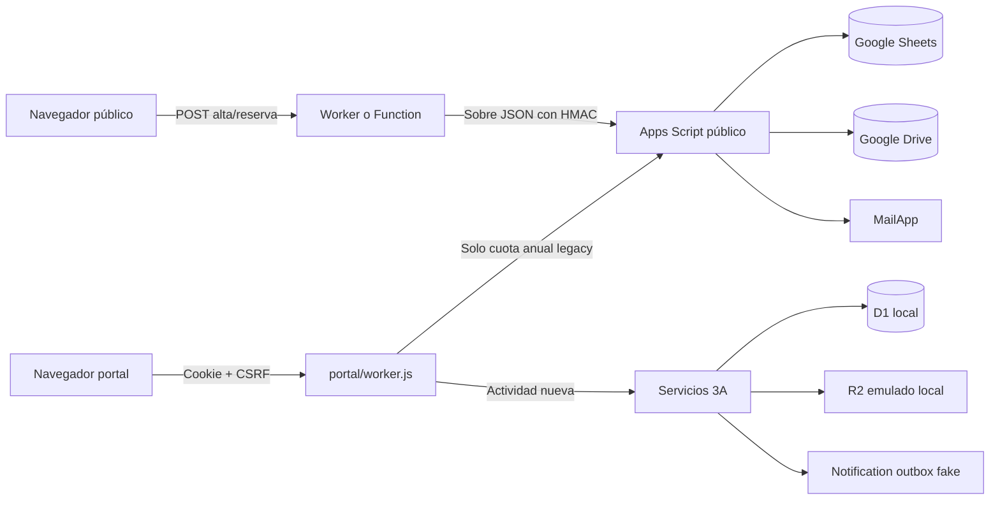

# Estado actual del sistema

Fecha de corte: **2026-09-24**
Fase: **3A consolidada — actividades e inscripciones locales sintéticas**
Repositorio auditado: `/Users/borja/Desktop/Grup Scout Parpalló/Web Parpallo`
Commit base: `90b2770` (`main`, alineado con `origin/main`)
Estado del árbol: **con cambios locales extensos previos a esta auditoría**.

## Actualización FASE 3A

La implementación inicial de FASE 3A está en `gestio/`; la consolidación de 2026-09-24 hace de `portal/` la única superficie familiar mantenida para actividades. `portal/public/` conserva el frontend anterior y `portal/worker.js` llama los servicios 3A para catálogo, inscripción, matching, pago, storage y outbox. `family/` queda **DEPRECATED / CANDIDATE_FOR_REMOVAL** y no se borra todavía. `gestio/` sigue siendo la plataforma interna. `0004_submission_matching_data.sql` añade datos temporales de envío; `0005_registration_authorizations.sql` añade trazabilidad de participación y lectura de privacidad y evita colapsar pendientes con fechas declaradas distintas. Las rutas de actividad dejan de usar Sheets, Drive y `data/activitats.json`. La cuota anual conserva su handler legacy sin cambios.

Los justificantes de prueba se guardan en R2 **emulado localmente** bajo estado ignorado de Wrangler; no existe bucket remoto. D1 local contiene metadata, no el binario. No se crearon recursos remotos ni se utilizaron datos reales.

El flujo integral y negativo se prueba en `test/gestio-3a.test.js` desde D1 vacía. El backup/restore 2B incluye las tablas 3A y sus invariantes, pero **no** copia objetos de storage; restaurar un justificante exige una copia independiente del objeto y reconciliación por clave/hash. Sin ella, la descarga posterior al restore falla cerrada. Ver [informe 3A](PHASE_3A_REPORT.md). Continúa **NOT PRODUCTION READY**: ni D1/R2 remoto, ni Access/MFA, ni Turnstile, ni correo real, ni datos reales. Las descripciones antiguas de flujos Google/portal son del sistema legado, no de la nueva fase 3A.

## 1. Alcance y semántica de estados

Este documento describe el árbol de trabajo actual, no solo el último commit. La FASE 0B-A corrigió guardas; la FASE 1 añadió `gestio/`; la FASE 2A añadió repositorios por dominio, `audit_event`, incidente/hold y lifecycle mínimo; la FASE 2B añadió backup/restore verificado **solo en D1 local** con datos ficticios; 3A añadió las superficies locales de actividad e inscripción. No se ha desplegado, migrado ni creado ningún recurso remoto. Evidencia: [PHASE_1_REPORT](PHASE_1_REPORT.md), [PHASE_2A_REPORT](PHASE_2A_REPORT.md), [PHASE_2B_REPORT](PHASE_2B_REPORT.md) e [informe 3A](PHASE_3A_REPORT.md).

El alcance se limita a la infraestructura nueva contenida en este repositorio. La web antigua que actualmente pueda estar publicada queda expresamente fuera de la auditoría, los hallazgos, los bloqueantes y el plan de implementación. En todo este documento, **web pública** significa la nueva superficie ubicada en `site/`.

- **IMPLEMENTED**: existe en el código inspeccionado.
- **TESTED**: existe y tiene una comprobación local ejecutada con resultado satisfactorio.
- **PENDING**: no existe o no se ha completado.
- **REQUIRES EXTERNAL CONFIGURATION**: depende de un panel, cuenta, DNS o proveedor no verificable desde el repositorio.
- **REQUIRES LEGAL VALIDATION**: depende de una decisión o validación jurídica/organizativa.
- **NOT PRODUCTION READY**: no debe tratarse como listo para datos reales.

La RC1 jurídica se consultó como fuente de requisitos. Su propio README indica que está pendiente de validación e implantación. No es autorización para tratar datos reales ni prueba de cumplimiento.

## 2. Tecnologías reales

| Capa | Tecnología encontrada | Estado |
|---|---|---|
| Frontend público | HTML, CSS y JavaScript sin framework | IMPLEMENTED |
| Portal familiar | HTML, CSS y JavaScript sin framework | IMPLEMENTED |
| Backend público | JavaScript ESM, adaptadores para Cloudflare Worker, Vercel y Netlify | IMPLEMENTED |
| Backend del portal | Cloudflare Worker con Static Assets | IMPLEMENTED |
| Runtime local | Node.js; auditado con Node `v24.18.0` y npm `11.16.0` | TESTED |
| Package manager | npm; lockfile v3 | IMPLEMENTED |
| Dependencias npm | Sin dependencias de ejecución; ESLint, TypeScript, Ajv y Wrangler fijados como desarrollo | IMPLEMENTED, AUDITED |
| Persistencia legacy (alta/reserva/cuota) | Google Sheets mediante Google Apps Script | IMPLEMENTED, EXTERNAL CONFIGURATION UNVERIFIED |
| Ficheros legacy de cuota | Google Drive mediante Apps Script | IMPLEMENTED, EXTERNAL CONFIGURATION UNVERIFIED |
| Correo legacy de cuota | `MailApp` de Google Apps Script | IMPLEMENTED, EXTERNAL CONFIGURATION UNVERIFIED |
| Base de datos/ORM | D1 local en `gestio/`, sin ORM | IMPLEMENTED LOCALLY, TESTED |
| Autenticación interna | Identidades ficticias y sesiones propias; adaptador JWT Access sin configuración remota | PARTIAL, TESTED LOCALLY |
| Autorización interna | Policy engine y consultas D1 con scope | IMPLEMENTED LOCALLY, TESTED |
| CI/CD | GitHub Actions: lint, `checkJs`, schemas, guardas, tests, audit, diff-check y Gitleaks | IMPLEMENTED IN CONFIG; FIRST REMOTE RUN PENDING |
| Contenedores | No hay Dockerfile ni Compose | NOT IMPLEMENTED / NOT REQUIRED FOR CURRENT STATIC SITE |

### Plataforma objetivo aprobada, solo prototipo local parcial

ADR-001 selecciona Cloudflare D1 y R2 con jurisdicción `eu`, Workers/Static Assets, Access y Turnstile para la primera versión. Esto no cambia el estado del código auditado:

- `gestio/` y `portal/` tienen bindings D1 exclusivamente locales, migraciones y seed sintético; `family/` es legacy/deprecated; no hay D1 remota;
- hay bindings R2 **solo para emulación local** y no existe bucket remoto;
- Turnstile no está integrado;
- Access no está configurado;
- no se ha creado ningún recurso remoto como parte de esta fase.

## 3. Estructura actual

```text
site/                 web pública y activos estáticos
api/_lib/             validación y lógica HTTP compartida
api/                  adaptadores Vercel
netlify/functions/    adaptadores Netlify
worker.js             Worker público Cloudflare
portal/               Worker y frontend familiar autoritativo para actividades y cuota legacy
family/               Worker 3A anterior, deprecated / candidate for removal
data/                 cuota JSON y fixture/catálogo legacy de actividades no autoritativo
scripts/              servidor local y Google Apps Script
test/                 pruebas Node
docs/                 documentación operativa y legal-técnica
Launchers/             lanzadores macOS
```

No hay framework, server actions ni ORM. `gestio/src/` contiene los servicios 3A; `portal/worker.js` consume únicamente las rutas necesarias para el canal familiar, mientras `gestio/` aplica identidad, policy y revisión interna. `family/` conserva el Worker anterior y no es el frontend familiar canónico.

## 4. Superficies existentes

### 4.1 Web pública nueva

La raíz publicable es `site/`. Contiene portada, secciones, cueva, merchandising, formulario de solicitud de plaza y páginas legales. Mantiene URLs terminadas en `.html`.

Rutas backend declaradas:

- `POST /api/alta`: solicitud pública de plaza.
- `POST /api/reserva`: reserva de merchandising.

No existe lectura pública de participantes. El Worker público devuelve 404 para cualquier API no declarada.

### 4.2 Portal familiar actual

`portal/` es un Worker separado. Ofrece:

- `POST /api/portal/session`: entrada mediante una contraseña compartida del curso.
- `GET /api/portal/session`: comprobación de sesión y entrega del token CSRF.
- `DELETE /api/portal/session`: cierre de sesión.
- `GET /api/portal/config`: catálogo de actividades y estado público de cuotas.
- `POST /api/inscripcio`: actividad nueva en D1/FASE 3A; justificante condicional, servicio de matching y outbox.
- `POST /api/cuota`: comunicación de cuota con justificante.

Las actividades publicadas se leen desde D1; la cuota anual sigue usando el flujo legacy y queda expresamente fuera de esta consolidación. La cookie compartida solo es una barrera de acceso casual, no autentica a la familia ni verifica parentesco.

La sesión es una cookie firmada HMAC, `HttpOnly`, `SameSite=Strict`, `Secure` fuera del modo local, con duración de 24 horas y versión revocable de forma global. No identifica a una familia. Es un filtro de acceso compartido, no autorización por persona ni por familia.

El portal no tiene endpoints de listado, búsqueda o lectura de participantes. En su alcance actual, la clave compartida protege una superficie de envío, no una ficha privada. No puede reutilizarse para el futuro portal interno ni para exponer datos existentes.

### 4.3 Portal interno de gestión

No existe `gestio.grupscoutparpallo.com` ni MFA/Access real. El prototipo local `gestio/` contiene panel básico, usuarios ficticios, roles/permisos, sesiones, suspensión, grants sanitarios sintéticos, audit log backend paginado, incidente/hold mínimo y UI funcional de actividades, inscripciones y pagos. Backup/restore D1 local sintético y drill están probados; backup de objetos, almacenamiento/cifrado/restore de producción y break-glass siguen pendientes. La UI no incluye aún vista de auditoría; el API sí.

## 5. Flujos de datos actuales



El Apps Script valida HMAC SHA-256, timestamp de cinco minutos y nonce temporal. Rechaza explícitamente el tipo `inscripcio`; usa `LockService` para referencias e idempotencia de cuota. Protege las celdas contra fórmulas mediante prefijo cuando el texto empieza por `=`, `+`, `-` o `@`.

### Datos tratados por el flujo actual

- Solicitud pública: identidad y contacto de menor/tutor, fecha de nacimiento y sección; no admite campo abierto ni datos de salud.
- Actividades: identidad y fecha de nacimiento auxiliar del participante, datos de quien envía, autorización de participación, acuse de privacidad y justificante solo cuando el precio D1 es positivo; sin DNI/NIE, salud ni observaciones libres sanitarias.
- Cuotas: identidad de uno o más menores, sección, tutor, contacto e imagen/PDF de justificante.
- Tienda: nombre, contacto, artículos y notas.

Los justificantes de cuota legacy se transmiten en base64, con límite nominal de 4 MB y comprobación de firma binaria inicial, y se guardan en Drive configurado externamente. Los justificantes sintéticos de actividades pasan por la abstracción de storage 3A; no existe cuarentena, análisis antimalware ni content disarm.

## 6. Controles existentes

| Control | Evidencia | Estado |
|---|---|---|
| Validación server-side | `api/_lib/*.js` | IMPLEMENTED, TESTED |
| Listas cerradas y límites | secciones, artículos, MIME, longitudes | IMPLEMENTED, TESTED |
| Cálculo económico server-side | precios y cuotas desde catálogo del servidor | IMPLEMENTED, TESTED |
| HMAC Worker → Apps Script | `api/_lib/sheets.js`, `google-apps-script.gs` | IMPLEMENTED, TESTED LOCALLY |
| Anti-replay | timestamp + nonce cacheado | IMPLEMENTED, NOT EXTERNALLY VERIFIED |
| CSRF del portal | token ligado a cookie y comprobación de origen | IMPLEMENTED, TESTED |
| Cookie segura del portal | `HttpOnly`, `SameSite=Strict`, `Secure` | IMPLEMENTED, TESTED LOCALLY |
| Idempotencia | clave de cliente; D1 para actividades y deduplicación en Sheets para cuota | IMPLEMENTED, TESTED LOCALLY |
| Mitigación de formula injection | `safeCell`/`safeRow` | IMPLEMENTED, NOT UNIT TESTED |
| Cabeceras del sitio | CSP, HSTS, COOP, no-sniff, frame denial | IMPLEMENTED IN CONFIG, EXTERNAL VERIFICATION PENDING |
| Minimización de logs | los handlers no registran payloads completos | IMPLEMENTED BY CODE REVIEW |
| Honeypot/tiempo mínimo | formularios públicos | IMPLEMENTED, TESTED |
| Rate limiting | memoria de proceso; binding Cloudflare solo para login | PARTIAL |
| Límite de body durante streaming | `http-body.js`, Workers y servidores locales | IMPLEMENTED, TESTED |
| Guarda de egress en desarrollo | `environment.js` + adaptador Sheets | IMPLEMENTED, TESTED |
| Lista de espera sin salud | HTML, validador, payload y Apps Script transitorio | IMPLEMENTED, TESTED |

## 7. Configuración, secretos y entornos

- `.env` está ignorado por Git y contiene valores locales no vacíos para el webhook y su secreto. No se reprodujeron.
- `ALLOWED_ORIGIN` está vacío en el `.env` local auditado.
- `.env.example` documenta el doble opt-in; no contiene credenciales.
- El historial Git visible no contiene `.env`; la búsqueda basada en patrones no encontró un secreto confirmado en archivos versionados.
- Hay un escaneo local conservador de alta confianza y Gitleaks v3 en CI; su primera ejecución remota sigue pendiente.
- `APP_ENV` y el inventario conceptual separan las políticas de development/staging/production; faltan todavía cuentas y recursos remotos separados.
- El launcher, `npm run dev` y `npm run dev:site` son sintéticos por defecto y no cargan `.env`.
- El modo de integración real es un comando distinto y exige `ALLOW_REAL_EGRESS=true` más allowlist exacta; la misma guarda se aplica antes de `fetch`.
- El portal local usa exclusivamente credenciales ficticias y un backend simulado.

## 8. Despliegue y Cloudflare

Hay configuración para tres alternativas de hosting de la web pública: Cloudflare, Vercel y Netlify. Esto es portabilidad de adaptadores, no evidencia de tres despliegues activos.

Para la nueva infraestructura, Cloudflare queda seleccionado como proveedor objetivo. Vercel/Netlify permanecen únicamente como adaptadores existentes de la web estática y no son la arquitectura objetivo de `gestio`.

`wrangler.toml` define el Worker público y `portal/wrangler.toml` el Worker familiar. No se ha validado ni configurado aquí DNS, Access ni despliegue; los valores de dominio de la configuración no constituyen evidencia de publicación.

No se verificaron paneles, DNS, WAF, Access, Turnstile, D1, R2, secrets de producción, región, TLS de origen ni reglas de rate limiting. Todo ello permanece **REQUIRES EXTERNAL CONFIGURATION**. La decisión exige que cualquier D1/R2 futuro con datos personales nazca con `jurisdiction = "eu"`; un location hint `weur` no cumple este requisito.

## 9. Pruebas ejecutadas

| Comprobación | Resultado |
|---|---|
| `npm run ci` | PASS en copia aislada y checkout real tras saneamiento FASE 3A: 86/86 tests, lint, typecheck, schemas, guardas y audit sin vulnerabilidades altas |
| `db:backup:test` / `db:restore:test` / `disaster:drill` | mismo drill integral local/sintético FASE 2B; PASS |
| `npm run lint` | PASS |
| `npm run typecheck` | PASS sobre la frontera gradual seleccionada |
| `npm run schema:check` | PASS: actividades, cuotas e inventario Cloudflare |
| Guardas Cloudflare/lista de espera/secretos | PASS local |
| `npm audit --audit-level=high` | 0 vulnerabilidades en 84 paquetes auditados |
| Build | NOT APPLICABLE/CURRENTLY ABSENT: sitio estático sin paso de build |
| CI/CD | CONFIGURED; primera ejecución en GitHub pendiente |
| Gitleaks | CONFIGURED IN CI; no ejecutado remotamente en esta fase |

Los tests usan fixtures declarados como ficticios. No se detectaron ficheros de datos reales de participantes en el repositorio. Las imágenes históricas pueden contener personas identificables; la legitimidad de su publicación no puede verificarse desde el código.

## 10. Conclusión del estado actual

La nueva web pública y sus formularios son una base pequeña, comprensible y testeada. Para actividades, `portal/` es ahora la plataforma familiar única prevista y no expone lectura de expedientes; la cuota anual sigue en su carril legacy. La consolidación no convierte el portal en una identidad verificada ni lo habilita para datos reales.

La futura gestión interna no debe construirse ampliando Sheets/Drive ni convirtiendo la contraseña compartida en una autenticación general. Necesita una nueva capa de aplicación, usuarios individuales, autorización centralizada, D1 con semántica SQLite, R2 privado, dominios de datos separados, auditoría y revocación.

Estado global: **NOT PRODUCTION READY para la nueva infraestructura y para cualquier tratamiento nuevo de datos reales**.
