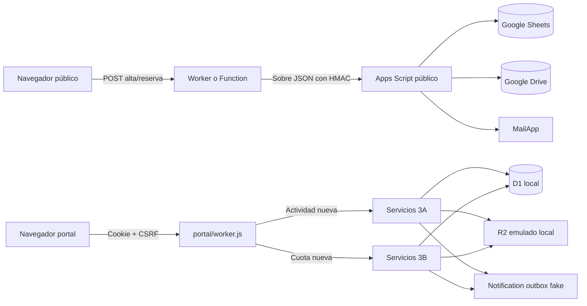

# Estado actual del sistema

Fecha de corte: **2026-10-01**
Fase: **3.5 — diseño de Gestió; 3.5D Activitats y 3.5E Participants cerradas en local (`phase-3.5e-complete`); 3.5F Inscripcions implementada en `phase/3.5f-registrations`, pendiente de revisión** (no declarada v1-ready)
Repositorio auditado: `/Users/borja/Desktop/Grup Scout Parpalló/Web Parpallo`
Base: `phase-3b-complete`; remediación `phase-3.5-audit-remediated`; 3.5D y 3.5E en `phase/3.5-design`, checkpoints `phase-3.5d-complete` y `phase-3.5e-complete` (sin merge a `main`).
Estado: **LOCAL / SYNTHETIC ONLY; NOT PRODUCTION READY; no desplegado**.

## Actualización FASE 3.5G.1A — seguridad previa a Tresoreria (2026-10-01, pendiente de revisión)

Detalle: [PHASE_3_5G1A_REPORT](PHASE_3_5G1A_REPORT.md). Especificación: [TREASURY.md](design/TREASURY.md) (`phase-3.5g0-complete`). Rama `phase/3.5g-treasury` (sin merge, sin tag de 1A).

- **Privacidad de Quotes:** proyecciones explícitas en listados y detalle de pagos; contacto del remitente solo bajo demanda con `finance.fee.contact.read`, auditado.
- **Justificantes de cuota:** vista y descarga auditadas (`FEE_EVIDENCE_VIEWED/DOWNLOADED`) con cabeceras seguras.
- **Delegación de sección sin autoridad financiera**; **delegación financiera explícita** (capacidad concreta, sección, caducidad obligatoria, revocable, auditada) sin rol nuevo (migración 0022).
- No se ha empezado el nuevo dominio financiero (3.5G.1).

## Actualización FASE 3.5F — Inscripcions (2026-10-01, pendiente de revisión)

Detalle y evidencias: [PHASE_3_5F_REPORT](PHASE_3_5F_REPORT.md). Especificación: [REGISTRATIONS.md](design/screens/REGISTRATIONS.md) v0.2. Rama `phase/3.5f-registrations` (sin merge, sin tag).

- **Migración 0018:** reconstrucción sin pérdida de `activity_registration`, `payment_evidence`, `notification_outbox` y `notification_capture`; sección de la inscripción, versión, escalado, `WITHDRAWN`, historial de correcciones de sección, avisos `REJECTED`/`WITHDRAWN`, metadatos de conservación de justificantes y permiso `activities.registration.contact.read`.
- **Autorización:** 404 indistinguible antes de cualquier 409; alcance por sección de la inscripción; escalado a revisión global sin revelar candidatos; corrección de sección con historial.
- **Contacto del remitente** fuera de los listados, bajo demanda y auditado. **Justificantes** con vista previa y descarga autenticadas y auditadas; optimización de fotos en el portal.
- **Cola global Inscripcions** (pendientes, incidencias, todas) y superficie temporal de pagos para Tresoreria hasta 3.5G; Inici y contador de navegación desde el resumen.
- **Participante vinculado** con acceso de perfil y **lista de confirmados** por actividad.
- **Pagos en varios plazos (migración 0019):** cada importe verificado es una asignación append-only; estado PENDING/PARTIAL/PAID/ISSUE derivado; la inscripción se confirma al cubrir el total.

## Actualización FASE 3.5E — Participants (2026-10-01, cerrada: `phase-3.5e-complete`)

Detalle y evidencias: [PHASE_3_5E_REPORT](PHASE_3_5E_REPORT.md). Especificación: [PARTICIPANTS.md](design/screens/PARTICIPANTS.md) v0.5. Integrada en `phase/3.5-design` (`97fb9f3`), tag `phase-3.5e-complete`.

- **Permisos y dominio (0015):** gestión de participantes por sección actual, server-side; Secretaria absorbe a `CRM_MANAGER`, retirado en el servicio (sin trigger).
- **Altas provisionales, edición, cambio de sección, baja**, completitud por edad derivada en servidor.
- **Família (0016):** tutores, contactos con consulta auditada, representación legal comunicada/acreditada con historial, cola de revisión de Secretaria y regla de tutor compartido.
- **Episodios de relación (0017):** una relación terminada con un tutor se conserva y puede seguirse de una nueva con el mismo tutor.
- **Inici:** fichas pendientes y revisiones; **delegaciones:** 90 días por defecto, máximo 365.

## Actualización FASE 3.5D — Activitats (2026-09-30)

Detalle y evidencias: [PHASE_3_5D_REPORT](PHASE_3_5D_REPORT.md). Especificación: [ACTIVITIES.md](design/screens/ACTIVITIES.md) v0.2.

- **Pantalla Activitats nueva** en Gestió: lista con filtros en la URL, drawer de Nova activitat / Editar, página de detalle con pestañas Inscripcions e Informació. La pantalla legacy y el panel legacy de revisión de inscripciones se han retirado.
- **Backend (migración 0014):** versión optimista en `activity` (`409 stale_activity`), descarte de borradores sin inscripciones, recuentos de inscripciones con el alcance del revisor en el listado, lectura de GENERAL separada de su gestión, `termsLocked` y transporte familiar a 0 € validado en servidor.
- **Routing por hash** sin framework (`gestio/public/router.js`), con deep links y restauración tras el login.
- **Actividades mixtas:** lectura con una sección en alcance; inscripciones, recuentos, revisión y gestión permanecen dentro del alcance de cada sección (regresión específica).
- **Demo:** escenarios D1–D12 con fechas relativas al seed.
- **Dependencias:** `wrangler` fijado en 4.144.0; `npm audit` sin vulnerabilidades.
- Las secciones siguientes describen estados anteriores y se conservan como historial.

## Actualización FASE 3.5 — remediación de auditoría (2026-09-29)

Detalle, evidencias, decisiones y deuda: [PHASE_3_5_AUDIT_REMEDIATION](PHASE_3_5_AUDIT_REMEDIATION.md).

- **Portal aislado (A1):** `portal/` ya no tiene D1/R2 ni importa `gestio/`; usa el service binding `GESTIO_INTAKE` → `PortalIntake` (catálogo, inscripción, cuota). [ADR-009](adr/ADR-009-portal-intake-service-binding.md).
- **Autorización (M1–M3):** catálogo GLOBAL/SCOPED que falla cerrado; `/api/me` devuelve capacidades; confirmación del autorizador y separación de funciones en delegaciones; política de roles elevados. [ADR-010](adr/ADR-010-permission-catalogue-capabilities.md).
- **Modelo de participantes (A2, migración 0011):** historial de sección coherente con `current_section_id`, tutores N:M, contactos extensibles y consentimientos append-only. Sin salud ni entidad familia.
- **Identidades (0012):** catálogo de autorización sin seed; alta de personas e invitación de identidad Access por API. Sin SQL manual ni autorregistro.
- **Otros:** paginación por cursor (M6); política de entorno única (M7); matching minimizado (M4); CSP estricta y `frame-ancestors` (L2); lecturas fuera de alcance como 404 (L1); frontend por vistas (M8); typecheck ampliado y suite smoke en workerd (M5); código JS de cuota legacy retirado (L5).
- Las secciones 3B, 3A y siguientes de este documento describen el estado anterior y se conservan como historial.

## Actualización FASE 3B

`portal/` conserva su UI familiar y ahora enruta las **cuotas nuevas** exclusivamente a `gestio/src/services/annual-fee-service.js`: ronda y datos bancarios de D1, matching server-side, justificante en storage emulado, pago pendiente de revisión y outbox ficticio. `gestio/` ofrece operaciones funcionales de Tesorería, obligaciones, agrupaciones familiares explícitas, fraccionamientos, asignaciones e incidencias. `0006_annual_fees.sql` separa obligación, transferencia y allocation. El importe declarado por la familia no verifica el banco ni determina deuda. El frontend familiar no muestra expedientes ni actualiza datos maestros. Ver [informe 3B](PHASE_3B_REPORT.md).

`api/_lib/handler-quota.js`, `api/_lib/quota.js`, `api/_lib/cuotes.js`, `data/cuotes.json` y las ramas de cuota de `scripts/google-apps-script.gs` se conservan **DEPRECATED / CANDIDATE_FOR_REMOVAL**, pero `portal/worker.js` ya no los importa ni les envía cuotas. Alta y reserva públicas conservan su integración legacy. Un Apps Script remoto previo podría seguir desplegado: **PRODUCTION_BLOCKER / MIGRATION_CHECK**; no se ha consultado ni modificado. Todo 3B continúa **LOCAL / SYNTHETIC ONLY; NOT PRODUCTION READY**.

## Actualización FASE 3A

La implementación inicial de FASE 3A está en `gestio/`; la consolidación de 2026-09-24 hace de `portal/` la única superficie familiar mantenida para actividades. `portal/public/` conserva el frontend anterior y `portal/worker.js` llama los servicios 3A para catálogo, inscripción, matching, pago, storage y outbox. `family/` queda **DEPRECATED / CANDIDATE_FOR_REMOVAL** y no se borra todavía. `gestio/` sigue siendo la plataforma interna. `0004_submission_matching_data.sql` añade datos temporales de envío; `0005_registration_authorizations.sql` añade trazabilidad de participación y lectura de privacidad y evita colapsar pendientes con fechas declaradas distintas. Las rutas de actividad dejan de usar Sheets, Drive y `data/activitats.json`. La referencia histórica a cuota legacy corresponde al estado 3A, antes de 3B.

Los justificantes de prueba se guardan en R2 **emulado localmente** bajo estado ignorado de Wrangler; no existe bucket remoto. D1 local contiene metadata, no el binario. No se crearon recursos remotos ni se utilizaron datos reales.

El flujo integral y negativo se prueba en `test/gestio-3a.test.js` desde D1 vacía. El backup/restore 2B incluye las tablas 3A y sus invariantes, pero **no** copia objetos de storage; restaurar un justificante exige una copia independiente del objeto y reconciliación por clave/hash. Sin ella, la descarga posterior al restore falla cerrada. Ver [informe 3A](PHASE_3A_REPORT.md). Continúa **NOT PRODUCTION READY**: ni D1/R2 remoto, ni Access/MFA, ni Turnstile, ni correo real, ni datos reales. Las descripciones antiguas de flujos Google/portal son del sistema legado, no de la nueva fase 3A.

## 1. Alcance y semántica de estados

Este documento describe el árbol de trabajo actual, no solo el último commit. La FASE 0B-A corrigió guardas; la FASE 1 añadió `gestio/`; la FASE 2A añadió repositorios por dominio, `audit_event`, incidente/hold y lifecycle mínimo; la FASE 2B añadió backup/restore verificado **solo en D1 local** con datos ficticios; 3A añadió las superficies locales de actividad e inscripción. No se ha desplegado, migrado ni creado ningún recurso remoto. Evidencia: [PHASE_1_REPORT](PHASE_1_REPORT.md), [PHASE_2A_REPORT](PHASE_2A_REPORT.md), [PHASE_2B_REPORT](PHASE_2B_REPORT.md) e [informe 3A](PHASE_3A_REPORT.md).

El alcance se limita a la infraestructura nueva contenida en este repositorio. La web antigua que actualmente pueda estar publicada queda expresamente fuera de la auditoría, los hallazgos, los bloqueantes y el plan de implementación. En todo este documento, **web pública** significa la nueva superficie ubicada en `site/`.

- **IMPLEMENTED**: existe en el código inspeccionado.
- **TESTED**: existe y tiene una comprobación local ejecutada con resultado satisfactorio.
- **PENDING**: no existe o no se ha completado.
- **REQUIRES EXTERNAL CONFIGURATION**: depende de un panel, cuenta, DNS o proveedor no verificable desde el repositorio.
- **REQUIRES LEGAL VALIDATION**: depende de una decisión o validación jurídica/organizativa.
- **NOT PRODUCTION READY**: no debe tratarse como listo para datos reales.

La RC1 jurídica se consultó como fuente de requisitos. Su propio README indica que está pendiente de validación e implantación. No es autorización para tratar datos reales ni prueba de cumplimiento.

## 2. Tecnologías reales

| Capa | Tecnología encontrada | Estado |
|---|---|---|
| Frontend público | HTML, CSS y JavaScript sin framework | IMPLEMENTED |
| Portal familiar | HTML, CSS y JavaScript sin framework | IMPLEMENTED |
| Backend público | JavaScript ESM, adaptadores para Cloudflare Worker, Vercel y Netlify | IMPLEMENTED |
| Backend del portal | Cloudflare Worker con Static Assets | IMPLEMENTED |
| Runtime local | Node.js; auditado con Node `v24.18.0` y npm `11.16.0` | TESTED |
| Package manager | npm; lockfile v3 | IMPLEMENTED |
| Dependencias npm | Sin dependencias de ejecución; ESLint, TypeScript, Ajv y Wrangler fijados como desarrollo | IMPLEMENTED, AUDITED |
| Persistencia legacy (alta/reserva; código de cuota no canónico) | Google Sheets mediante Google Apps Script | IMPLEMENTED, EXTERNAL CONFIGURATION UNVERIFIED |
| Ficheros legacy de cuota | Google Drive mediante Apps Script | DEPRECATED; no usados por cuotas nuevas de `portal/` |
| Correo legacy de cuota | `MailApp` de Google Apps Script | DEPRECATED; no usado por cuotas nuevas de `portal/` |
| Base de datos/ORM | D1 local en `gestio/`, sin ORM | IMPLEMENTED LOCALLY, TESTED |
| Autenticación interna | Identidades ficticias y sesiones propias; adaptador JWT Access sin configuración remota | PARTIAL, TESTED LOCALLY |
| Autorización interna | Policy engine y consultas D1 con scope | IMPLEMENTED LOCALLY, TESTED |
| CI/CD | GitHub Actions: lint, `checkJs`, schemas, guardas, tests, audit, diff-check y Gitleaks | IMPLEMENTED IN CONFIG; FIRST REMOTE RUN PENDING |
| Contenedores | No hay Dockerfile ni Compose | NOT IMPLEMENTED / NOT REQUIRED FOR CURRENT STATIC SITE |

### Plataforma objetivo aprobada, solo prototipo local parcial

ADR-001 selecciona Cloudflare D1 y R2 con jurisdicción `eu`, Workers/Static Assets, Access y Turnstile para la primera versión. Esto no cambia el estado del código auditado:

- `gestio/` y `portal/` tienen bindings D1 exclusivamente locales, migraciones y seed sintético; `family/` es legacy/deprecated; no hay D1 remota;
- hay bindings R2 **solo para emulación local** y no existe bucket remoto;
- Turnstile no está integrado;
- Access no está configurado;
- no se ha creado ningún recurso remoto como parte de esta fase.

## 3. Estructura actual

```text
site/                 web pública y activos estáticos
api/_lib/             validación y lógica HTTP compartida
api/                  adaptadores Vercel
netlify/functions/    adaptadores Netlify
worker.js             Worker público Cloudflare
portal/               Worker y frontend familiar autoritativo para actividades 3A y cuotas 3B
family/               Worker 3A anterior, deprecated / candidate for removal
data/                 cuota JSON y fixture/catálogo legacy; no autoritativos para nuevas actividades/cuotas
scripts/              servidor local y Google Apps Script
test/                 pruebas Node
docs/                 documentación operativa y legal-técnica
Launchers/             lanzadores macOS
```

No hay framework, server actions ni ORM. `gestio/src/` contiene los servicios 3A; `portal/worker.js` consume únicamente las rutas necesarias para el canal familiar, mientras `gestio/` aplica identidad, policy y revisión interna. `family/` conserva el Worker anterior y no es el frontend familiar canónico.

## 4. Superficies existentes

### 4.1 Web pública nueva

La raíz publicable es `site/`. Contiene portada, secciones, cueva, merchandising, formulario de solicitud de plaza y páginas legales. Mantiene URLs terminadas en `.html`.

Rutas backend declaradas:

- `POST /api/alta`: solicitud pública de plaza.
- `POST /api/reserva`: reserva de merchandising.

No existe lectura pública de participantes. El Worker público devuelve 404 para cualquier API no declarada.

### 4.2 Portal familiar actual

`portal/` es un Worker separado. Ofrece:

- `POST /api/portal/session`: entrada mediante una contraseña compartida del curso.
- `GET /api/portal/session`: comprobación de sesión y entrega del token CSRF.
- `DELETE /api/portal/session`: cierre de sesión.
- `GET /api/portal/config`: catálogo de actividades y estado público de cuotas.
- `POST /api/inscripcio`: actividad nueva en D1/FASE 3A; justificante condicional, servicio de matching y outbox.
- `POST /api/cuota`: submission 3B con justificante obligatorio, D1 local y outbox fake; sin Sheets/Drive.

Las actividades publicadas y la ronda de cuota abierta se leen desde D1. La cookie compartida solo es una barrera de acceso casual, no autentica a la familia ni verifica parentesco.

La sesión es una cookie firmada HMAC, `HttpOnly`, `SameSite=Strict`, `Secure` fuera del modo local, con duración de 24 horas y versión revocable de forma global. No identifica a una familia. Es un filtro de acceso compartido, no autorización por persona ni por familia.

El portal no tiene endpoints de listado, búsqueda o lectura de participantes. En su alcance actual, la clave compartida protege una superficie de envío, no una ficha privada. No puede reutilizarse para el futuro portal interno ni para exponer datos existentes.

### 4.3 Portal interno de gestión

No existe `gestio.grupscoutparpallo.com` ni MFA/Access real. El prototipo local `gestio/` contiene panel básico, usuarios ficticios, roles/permisos, sesiones, suspensión, grants sanitarios sintéticos, audit log backend paginado, incidente/hold mínimo y UI funcional de actividades, inscripciones, cuotas y revisión de pagos. Backup/restore D1 local sintético y drill están probados; backup de objetos, almacenamiento/cifrado/restore de producción y break-glass siguen pendientes. La UI no incluye aún vista de auditoría; el API sí.

## 5. Flujos de datos actuales



El Apps Script valida HMAC SHA-256, timestamp de cinco minutos y nonce temporal. Rechaza explícitamente el tipo `inscripcio`; usa `LockService` para referencias e idempotencia de cuota. Protege las celdas contra fórmulas mediante prefijo cuando el texto empieza por `=`, `+`, `-` o `@`.

### Datos tratados por el flujo actual

- Solicitud pública: identidad y contacto de menor/tutor, fecha de nacimiento y sección; no admite campo abierto ni datos de salud.
- Actividades: identidad y fecha de nacimiento auxiliar del participante, datos de quien envía, autorización de participación, acuse de privacidad y justificante solo cuando el precio D1 es positivo; sin DNI/NIE, salud ni observaciones libres sanitarias.
- Cuotas nuevas: identidad y fecha de nacimiento auxiliar de uno o más educandos, sección, nombre/correo de quien envía, teléfono opcional, acuse de privacidad y justificante sintético obligatorio. La transferencia declarada es informativa.
- Tienda: nombre, contacto, artículos y notas.

Los justificantes de cuota **nueva** y actividades pasan por la misma abstracción de storage emulado local (4 MiB, MIME/firma/extensión, nombre seguro y hash); la metadata está en D1 y los binarios fuera del backup SQL. El código de cuota legacy todavía podría escribir en Drive si algún flujo antiguo externo lo invocara; `portal/` ya no lo hace. No existe cuarentena, análisis antimalware ni content disarm.

## 6. Controles existentes

| Control | Evidencia | Estado |
|---|---|---|
| Validación server-side | `api/_lib/*.js` | IMPLEMENTED, TESTED |
| Listas cerradas y límites | secciones, artículos, MIME, longitudes | IMPLEMENTED, TESTED |
| Cálculo económico server-side | precios y cuotas desde catálogo del servidor | IMPLEMENTED, TESTED |
| HMAC Worker → Apps Script | `api/_lib/sheets.js`, `google-apps-script.gs` | IMPLEMENTED, TESTED LOCALLY |
| Anti-replay | timestamp + nonce cacheado | IMPLEMENTED, NOT EXTERNALLY VERIFIED |
| CSRF del portal | token ligado a cookie y comprobación de origen | IMPLEMENTED, TESTED |
| Cookie segura del portal | `HttpOnly`, `SameSite=Strict`, `Secure` | IMPLEMENTED, TESTED LOCALLY |
| Idempotencia | clave de cliente + hash en D1 para actividades y cuotas nuevas; deduplicación Sheets solo en código legacy | IMPLEMENTED, TESTED LOCALLY |
| Mitigación de formula injection | `safeCell`/`safeRow` | IMPLEMENTED, NOT UNIT TESTED |
| Cabeceras del sitio | CSP, HSTS, COOP, no-sniff, frame denial | IMPLEMENTED IN CONFIG, EXTERNAL VERIFICATION PENDING |
| Minimización de logs | los handlers no registran payloads completos | IMPLEMENTED BY CODE REVIEW |
| Honeypot/tiempo mínimo | formularios públicos | IMPLEMENTED, TESTED |
| Rate limiting | memoria de proceso; binding Cloudflare solo para login | PARTIAL |
| Límite de body durante streaming | `http-body.js`, Workers y servidores locales | IMPLEMENTED, TESTED |
| Guarda de egress en desarrollo | `environment.js` + adaptador Sheets | IMPLEMENTED, TESTED |
| Lista de espera sin salud | HTML, validador, payload y Apps Script transitorio | IMPLEMENTED, TESTED |

## 7. Configuración, secretos y entornos

- `.env` está ignorado por Git y contiene valores locales no vacíos para el webhook y su secreto. No se reprodujeron.
- `ALLOWED_ORIGIN` está vacío en el `.env` local auditado.
- `.env.example` documenta el doble opt-in; no contiene credenciales.
- El historial Git visible no contiene `.env`; la búsqueda basada en patrones no encontró un secreto confirmado en archivos versionados.
- Hay un escaneo local conservador de alta confianza y Gitleaks v3 en CI; su primera ejecución remota sigue pendiente.
- `APP_ENV` y el inventario conceptual separan las políticas de development/staging/production; faltan todavía cuentas y recursos remotos separados.
- El launcher, `npm run dev` y `npm run dev:site` son sintéticos por defecto y no cargan `.env`.
- El modo de integración real es un comando distinto y exige `ALLOW_REAL_EGRESS=true` más allowlist exacta; la misma guarda se aplica antes de `fetch`.
- El portal local usa exclusivamente credenciales ficticias y un backend simulado.

## 8. Despliegue y Cloudflare

Hay configuración para tres alternativas de hosting de la web pública: Cloudflare, Vercel y Netlify. Esto es portabilidad de adaptadores, no evidencia de tres despliegues activos.

Para la nueva infraestructura, Cloudflare queda seleccionado como proveedor objetivo. Vercel/Netlify permanecen únicamente como adaptadores existentes de la web estática y no son la arquitectura objetivo de `gestio`.

`wrangler.toml` define el Worker público y `portal/wrangler.toml` el Worker familiar. No se ha validado ni configurado aquí DNS, Access ni despliegue; los valores de dominio de la configuración no constituyen evidencia de publicación.

No se verificaron paneles, DNS, WAF, Access, Turnstile, D1, R2, secrets de producción, región, TLS de origen ni reglas de rate limiting. Todo ello permanece **REQUIRES EXTERNAL CONFIGURATION**. La decisión exige que cualquier D1/R2 futuro con datos personales nazca con `jurisdiction = "eu"`; un location hint `weur` no cumple este requisito.

## 9. Pruebas ejecutadas

| Comprobación | Resultado |
|---|---|
| `npm run ci` | PASS local FASE 3B: 94/94 tests (baseline 3A: 93/93), lint, typecheck, schemas, guardas y audit sin vulnerabilidades altas |
| `db:backup:test` / `db:restore:test` / `disaster:drill` | mismo drill integral local/sintético FASE 2B; PASS |
| `npm run lint` | PASS |
| `npm run typecheck` | PASS sobre la frontera gradual seleccionada |
| `npm run schema:check` | PASS: actividades, cuotas e inventario Cloudflare |
| Guardas Cloudflare/lista de espera/secretos | PASS local |
| `npm audit --audit-level=high` | 0 vulnerabilidades en 84 paquetes auditados |
| Build | NOT APPLICABLE/CURRENTLY ABSENT: sitio estático sin paso de build |
| CI/CD | CONFIGURED; primera ejecución en GitHub pendiente |
| Gitleaks | CONFIGURED IN CI; no ejecutado remotamente en esta fase |

Los tests usan fixtures declarados como ficticios. No se detectaron ficheros de datos reales de participantes en el repositorio. Las imágenes históricas pueden contener personas identificables; la legitimidad de su publicación no puede verificarse desde el código.

## 10. Conclusión del estado actual

La nueva web pública y sus formularios son una base pequeña, comprensible y testeada. Para actividades y cuotas nuevas, `portal/` es la plataforma familiar única y no expone lectura de expedientes. La consolidación no convierte el portal en una identidad verificada ni lo habilita para datos reales.

La futura gestión interna no debe construirse ampliando Sheets/Drive ni convirtiendo la contraseña compartida en una autenticación general. Necesita una nueva capa de aplicación, usuarios individuales, autorización centralizada, D1 con semántica SQLite, R2 privado, dominios de datos separados, auditoría y revocación.

Estado global: **NOT PRODUCTION READY para la nueva infraestructura y para cualquier tratamiento nuevo de datos reales**.
