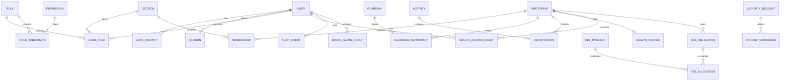

# Modelo conceptual de datos

Estado: **MODELO GENERAL DRAFT; SUBCONJUNTOS FASE 1, 2A, 3A Y 3B MIGRADOS EN D1 LOCAL — SYNTHETIC DATA ONLY**

FASE 3B: `0006_annual_fees.sql` separa `annual_fee_round`, agrupación familiar explícita (`annual_fee_family_group/member`), obligación individual, envío/transferencia declarada (`annual_fee_payment`), persona sometida a matching, metadata de justificante, allocation, fraccionamiento, ISSUE y outbox/captura ficticia. La relación de hermanos se introduce por una persona autorizada, con orden y auditoría; **nunca** se infiere por apellido, correo o teléfono. La obligación conserva snapshot de base/descuento/importes de la ronda en la fecha de creación; cambios posteriores de configuración no reescriben deuda ya creada. `amount_due_cents` puede corregirse manualmente con auditoría; el estado `PENDING/PARTIAL/PAID/ISSUE` se deriva de allocations de pagos bancariamente verificados y de incidencias abiertas. No se prorratea ni reembolsa automáticamente. El fraccionamiento autorizado contiene dos partes, importes positivos que suman la deuda y fechas opcionales; no guarda motivo económico. El pago admite varios educandos y `declared_amount_cents` no es autoritativo. `verified_amount_cents` y allocations requieren revisión humana; su suma no puede superar el verificado. Las tablas `annual_fee_round_revision`, `annual_fee_amount_revision` y `annual_fee_allocation_revision` conservan los valores financieros anteriores/nuevos al cambiar configuración, deuda o reparto, sin copiar IBAN ni circunstancias familiares. La fecha de nacimiento enviada se retiene solo para los matches pendientes y se borra tras vincular/rechazar; el hash de idempotencia vincula el envío sin duplicar la fecha clara. La cuota nueva no modifica participante/contacto maestro ni crea tutela verificada. Retención y textos jurídicos definitivos: **LEGAL_DECISION_REQUIRED**.

FASE 3A: `0003_activities_registrations.sql` materializa actividades, secciones, transporte, inscripciones, evidencias, delegaciones y outbox; `0004_submission_matching_data.sql` añade datos de envío y matching auxiliar; `0005_registration_authorizations.sql` añade `participation_terms_version`, `participation_authorized_at`, `privacy_notice_version` y `privacy_notice_acknowledged_at` para nuevos envíos sintéticos. El antiguo `consent_version` permanece **DEPRECATED** por compatibilidad de esquema: las filas anteriores no se reinterpretan ni se completan con autorizaciones no demostradas; las nuevas usan el marcador `DEPRECATED`. La privacidad se registra como acuse de lectura del aviso, no consentimiento RGPD; no se recoge autorización de imagen. Una inscripción nunca crea participante/guardian ni actualiza datos maestros. `submitted_by_name`, `receipt_email` (obligatorio) y `contact_phone` (opcional) describen el envío; el email no autentica identidad ni actualiza contacto maestro. `submitted_birth_date` solo se conserva mientras el vínculo requiere revisión; tras match inequívoco, vinculación humana o rechazo se limpia. La fecha sirve como factor junto con nombre y sección, no como PK; diferencia solicitudes pendientes con mismo nombre/sección. `payment_evidence` guarda clave de objeto, hash, tamaño y MIME, no binario; la captura de notificación solo contiene mensajes `.test` locales. Retenciones de inscripción, justificante y outbox: **LEGAL_DECISION_REQUIRED**.

El subconjunto real de FASE 1 está en `gestio/migrations/0001_identity_policy.sql`: identidad, sesión, roles, grants, participante ficticio mínimo y evento de seguridad. `0002_domain_audit_incidents.sql` añade auditoría estructurada, incidente, hold y política de retención desactivada. Salud de contenido, membresía histórica y tutela/CRM familiar completo continúan conceptuales; 3B solo añade agrupación familiar explícita para descuentos. Las nuevas filas usan UUID aleatorio de backend y el seed IDs fijos exclusivamente sintéticos.

## 1. Leyenda

- **STABLE**: frontera o concepto necesario con independencia del proveedor.
- **PROVISIONAL**: estructura técnica recomendada, sujeta a iteración.
- **LEGAL_DECISION_REQUIRED**: campos, base jurídica o conservación no cerrados.

## 2. Principios estables

- UUIDv7 o identificador aleatorio equivalente como clave interna.
- DNI, email, nombre, teléfono y SIP nunca son claves primarias.
- identidad/administración, salud y economía son dominios separados.
- acceso a salud deny-by-default y por participante.
- toda relación sensible es explícita, temporal y auditable.
- el navegador nunca recibe credenciales privilegiadas de DB.
- las consultas se autorizan antes de ejecutarse y vuelven a filtrar por scope.
- no existe una tabla `participants_everything`.

### 2.1 Persistencia seleccionada

La implementación objetivo es Cloudflare D1 con jurisdicción `eu`, según [ADR-001](adr/ADR-001-cloudflare-first-eu.md). El modelo conceptual se traducirá a SQLite/D1:

- UUIDv7 almacenado como `TEXT`, generado en backend y validado antes de persistir;
- dinero como entero en unidad mínima, nunca `REAL`;
- booleanos/estados con `INTEGER` o `TEXT` más `CHECK`;
- timestamps en una representación UTC única y comparable;
- claves foráneas, uniques e índices explícitos;
- JSON solo para metadatos limitados y no como sustituto de relaciones autorizables;
- ninguna dependencia de tipos, extensiones o funciones exclusivas de PostgreSQL.

Las migraciones se ejecutarán primero contra D1 local con fixtures sintéticos. Ninguna base remota se creará hasta autorización expresa; cuando se autorice deberá nacer con `--jurisdiction=eu`, no solo con `--location=weur`.

## 3. Vista conceptual



## 4. Identidad y acceso

### `user` — STABLE

- `id` UUIDv7 PK
- `display_name`
- `status`: `ACTIVE | DISABLED | SECURITY_BLOCKED`
- `created_at`, `updated_at`
- `disabled_at`, `security_blocked_at`
- `version` para invalidación concurrente

No contiene contraseña si la identidad vive en un IdP.

### `auth_identity` — STABLE

- `id`, `user_id`
- `issuer`, `subject` con unique compuesto
- `verified_email` como atributo mutable, no identidad primaria
- `last_seen_at`

### `session` — PROVISIONAL

- `id`, `user_id`, `token_hash`
- `created_at`, `last_seen_at`, `expires_at`
- `revoked_at`, `revoke_reason`
- metadatos minimizados de seguridad: hash/truncado de IP o device cuando esté justificado

### autorización — STABLE

- `role`, `permission`
- `role_permission`
- `user_role` con `section_id`, vigencia y otorgante
- `user_permission_grant` para excepciones explícitas
- `permission_denial` opcional para denegaciones expresas

## 5. Organización y personas

### `section` — STABLE

- `id`, `code`, nombres localizados
- `active_from`, `active_until`

### `participant` — STABLE

- `id`
- nombre legal descompuesto y nombre preferido **PROVISIONAL**
- fecha de nacimiento auxiliar para matching de actividad; decisión de uso en ese flujo fijada el 2026-09-24; cualquier otro uso queda sujeto a decisión/validación aparte
- estado de ciclo de vida
- sin salud ni pagos embebidos

Normalización: preservar la grafía original y Unicode NFC; almacenar campos auxiliares de búsqueda normalizados solo cuando estén justificados. No eliminar diacríticos del dato fuente.

### `guardian` y `guardian_participant` — STABLE

`guardian` representa a una persona adulta; la relación guarda tipo, capacidad declarada/verificada, vigencia y permisos de contacto. No se presupone que todo tutor pueda ejercer todas las acciones.

### `membership` — STABLE

- participante, sección, curso/ronda, estado, fechas
- separación entre pertenencia actual e histórico

## 6. Actividades e inscripciones

### `activity` — STABLE

- `id`, código público independiente, nombres, fechas, capacidad, estado
- secciones admitidas mediante tabla relacional
- importe en unidad monetaria mínima

### `registration` — STABLE

- `id`, `activity_id`, `participant_id`
- estado, timestamps, actor/canal de creación
- versión de textos/autorizaciones aceptadas
- idempotency key con scope y expiración

Una inscripción a actividad **no crea automáticamente** un participante ni modifica participantes, guardianes, relaciones o contactos maestros. Nombre de quien envía, email y teléfono son datos de envío. El matching se ejecuta solo en backend por nombre normalizado, sección y fecha de nacimiento auxiliar, sin alterar el nombre oficial:

```text
CLEAR MATCH     → propuesta de vínculo permitido
AMBIGUOUS MATCH → HUMAN REVIEW
NO MATCH        → HUMAN REVIEW
```

El portal familiar nunca devuelve candidatos, coincidencias ni confirma pertenencia al grupo. En coincidencia inequívoca se persiste `participant_id` y no se guarda copia de la fecha enviada. En revisión humana, `submitted_birth_date` es temporal; el revisor interno puede compararla con fechas maestras dentro de su scope. Matching/rechazo borra el dato temporal y audita la decisión. La vinculación definitiva debe quedar auditada.

### DNI en campamentos — LEGAL_DECISION_REQUIRED

Por defecto, la inscripción ordinaria no depende de DNI y el campo debe omitirse. Solo podrá reintroducirse si se aprueba una finalidad concreta y necesidad demostrada. En ese caso:

- entidad/campo separado de la ficha general;
- cifrado de aplicación;
- acceso por permiso y finalidad;
- no indexar para búsquedas generales;
- borrado/bloqueo según política aprobada;
- nunca primary key ni dato visible en listados ordinarios.

## 7. Salud

### `health_profile` — STABLE COMO FRONTERA; CAMPOS PROVISIONAL

- `id`, `participant_id`, `ciphertext`, `key_version`
- `updated_by`, `updated_at`, `record_version`
- metadatos mínimos no clínicos para control técnico

Los campos sanitarios definitivos y su base del art. 9 son **LEGAL_DECISION_REQUIRED**.

### `health_access_grant` — STABLE

- `id`
- `user_id`, `participant_id`
- `permission`: por ejemplo `health.read` o `health.update`
- `purpose`
- `granted_by`, `granted_at`
- `valid_from`, `expires_at`, `revoked_at`
- `reason_reference`
- `section_id` opcional solo como contexto; nunca sustituye `participant_id`

Un cargo de sección no crea automáticamente este grant.

### Medicación

Separar autorización, pauta y administración registrada. Modelo y campos: **LEGAL_DECISION_REQUIRED**. No incorporarlos por analogía a un textarea.

## 8. Economía

### Entidades — STABLE COMO FRONTERA

- `fee_schedule`: curso, reglas e importes versionados.
- `fee_obligation`: obligación por participante y concepto.
- `payment_evidence`: objeto privado, checksum, estado de escaneo, retención.
- `fee_allocation`: reparto de un pago entre obligaciones.
- `financial_event`: cambios de estado auditables.

No guardar números de cuenta o contenido bancario adicional si no es imprescindible. La necesidad del justificante y sus campos es **LEGAL_DECISION_REQUIRED**.

## 9. Auditoría, incidentes y break-glass

### `audit_event` — STABLE

- `id`, `occurred_at`, `request_id`
- `actor_user_id` nullable para anónimo/sistema
- `actor_type`
- `action`, `resource_type`, `resource_id`
- `section_id`, `purpose`
- `decision`: `ALLOW | DENY | ERROR`
- `reason_code`, `policy_version`
- metadatos minimizados; sin payload completo, token o salud
- integridad: cadena/hash o exportación a almacenamiento inmutable **PROVISIONAL**

### `security_incident` — STABLE

- severidad, estado, detección, contención, responsable
- referencias a recursos y evidencias, no copias indiscriminadas

### `break_glass_grant` — STABLE

- usuario, aprobador, recurso/scope, propósito/motivo
- inicio, expiración, revocación
- todas las acciones asociadas mediante `grant_id` en audit log

## 10. Ciclo de vida

Cada dominio debe soportar:

```text
ACTIVE → INACTIVE → BLOCKED_WHEN_LEGALLY_REQUIRED → DELETED/DESTROYED
```

Esto no es el estado de cuenta. Los plazos y transiciones son **LEGAL_DECISION_REQUIRED**. Los jobs deben ser idempotentes, auditados y generar informe de excepciones.

## 11. Storage de objetos

- Cloudflare R2 Standard privado por entorno y, preferiblemente, por dominio;
- todo bucket con documentos o datos personales creado con jurisdicción `eu`, nunca solo con location hint `weur`;
- binding del Worker con `jurisdiction = "eu"` y comprobación del metadato remoto antes de uso;
- objeto identificado por UUID, no por nombre aportado;
- metadatos: checksum, tamaño, MIME detectado, estado de escaneo, propietario lógico, expiración;
- cuarentena inicial;
- URL firmada breve solo tras autorización;
- descarga con `Content-Disposition: attachment` y nombre seguro;
- lifecycle compatible con retención y bloqueo.

D1 guarda únicamente los metadatos y la clave del objeto; el binario no se almacena en la base.

## 12. Restricciones de integridad

- unique de identidad externa (`issuer`, `subject`);
- roles con vigencia y scope válidos;
- grants sanitarios siempre con participante, purpose y expiración;
- ninguna sesión activa para usuario no activo;
- estados mediante enums/tablas controladas;
- cambios sensibles con control optimista de versión;
- soft-delete no se usa como sustituto automático del bloqueo jurídico.
