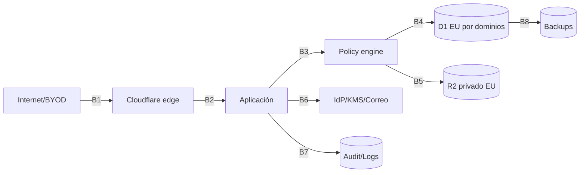

# Threat model

Fecha: **2026-09-22**
Método: activos + trust boundaries + abuse cases, informado por STRIDE, OWASP ASVS 5.0.0 y OWASP API Security Top 10 2023.

Actualización 2026-09-24: frontera familiar canónica `portal/` → servicios 3A → D1 local/storage sintético/outbox; `family/` queda deprecated, no eliminado. Se conserva el filtro de sesión compartida, que no autentica a la familia. Matching se hace en servidor con nombre, sección y fecha auxiliar; fecha de envío solo permanece durante revisión, y los datos de inscripción no actualizan las fichas maestras. Amenazas probadas: enumeración, código/precio/estado manipulados, duplicado/replay, cambio de fecha con idempotency key pendiente, justificante MIME/extensión/tamaño inválido, revisión cross-section y transición concurrente obsoleta. Mitigaciones: respuesta neutral, cálculo server-side, scopes, índices únicos, triggers y audit minimizado. Riesgos residuales: abuso sin Turnstile/rate limit distribuido, malware, falsificación de contacto familiar, notificaciones fake, compromiso Cloudflare y pérdida de objetos R2 no cubierta por backup D1. Bloquea uso real hasta controles externos y decisión jurídica.

## 1. Alcance

Incluye la nueva web pública `site/`, el portal familiar, el futuro portal interno, Workers, D1 `eu`, R2 `eu`, Turnstile, IdP/Access, logs, backups, despliegue y dispositivos personales. La web antigua actualmente publicada queda fuera del sistema evaluado.

No se realizó pentest activo, acceso a paneles, revisión de cuentas Google/Cloudflare ni análisis forense.

## 2. Activos

1. identidad y contacto de participantes y tutores;
2. pertenencia al grupo y sección;
3. datos sanitarios y de medicación;
4. DNI/SIP cuando estén legalmente justificados;
5. cuotas, justificantes y estados económicos;
6. credenciales, sesiones, MFA y grants;
7. registros de auditoría e incidentes;
8. secretos, claves KMS y configuración;
9. disponibilidad e integridad de inscripciones;
10. backups y capacidad de recuperación;
11. reputación, dominio y canales oficiales.

## 3. Actores

- atacante anónimo de Internet;
- bot automatizado/scraper;
- atacante con contraseña robada;
- atacante con sesión ya autenticada/MFA;
- phishing;
- dispositivo personal perdido o comprometido;
- cuenta de coordinador comprometida;
- insider malicioso;
- usuario autorizado curioso;
- intento de acceso entre secciones;
- abuso de administrador técnico;
- atacante con acceso a DB o backup;
- persona que obtiene un secreto de Git;
- atacante que aprovecha Cloudflare/origin mal configurado;
- dependencia o pipeline comprometido;
- error de desarrollador/operador;
- ransomware o borrado destructivo.

## 4. Trust boundaries

Cada cruce requiere autenticación de canal, mínimos permisos, límites, errores seguros y observabilidad.

## 5. Escenarios y controles

| ID | Escenario | Situación actual | Controles objetivo | Riesgo residual |
|---|---|---|---|---|
| T-01 | Bot inunda formularios | honeypot + límite en memoria; Turnstile ausente | Turnstile/Siteverify + WAF + límite distribuido + cuotas | botnet distribuida |
| T-02 | Password familiar filtrada | clave compartida, rate limit login | solo envío; rotación; no lecturas; futura credencial por recurso | reenvío voluntario de clave |
| T-03 | Password/MFA de interno robados | no existe `gestio` | MFA resistente al phishing si es viable, step-up, sesión corta, alertas | sesión robada ya emitida |
| T-04 | Session hijacking | cookie portal segura | cookies `__Host`, server-side, revocación, CSP, device/session view | malware en BYOD |
| T-05 | BOLA/cross-section | no hay APIs internas | autorización por objeto + query scope + tests negativos | fallo de policy nuevo |
| T-06 | Rol del cliente manipulado | no hay roles cliente | claims no autoritativos; roles solo DB backend | bug de mapeo IdP |
| T-07 | Coordinador curioso lee salud | lista de espera saneada; otros flujos/datos históricos no migrados | dominio health + grant por participante/purpose/tiempo | abuso con grant legítimo |
| T-08 | TECH_ADMIN abusa | acceso externo no modelado | deny datos, separación de funciones, break-glass y alertas | control del KMS/infra por persona privilegiada |
| T-09 | Apps Script/Sheet comprometidos | HMAC protege escritura, permisos externos no verificados | retirar como core; cuentas individuales; monitorizar | compromiso de proveedor |
| T-10 | D1 comprometida o mal autorizada | D1 aún no existe | jurisdicción `eu`, mínimos privilegios, autorización backend y cifrado de campo en salud | metadatos y memoria de app |
| T-11 | Backup D1/R2 exfiltrado | copia D1 local sintética sin cifrar, ignorada por Git; verificación de checksum/secret canaries | cifrado antes de almacenamiento, acceso separado, auditoría administrativa y restore tests | compromiso simultáneo de cuenta y claves; backups locales sin cifrar |
| T-12 | Secret en Git | `.env` ignorado, scan local y Gitleaks en CI | required check, push protection, rotación | secreto en logs/artefactos |
| T-13 | Cloudflare mal configurado | configuración externa desconocida | Access + validación JWT + origin lock/Tunnel | error de política edge |
| T-14 | Origen directo evita Access | no existe `gestio` | Tunnel o allowlist/mTLS y validación JWT | exposición accidental de otro hostname |
| T-15 | Upload malicioso en R2 | magic bytes parciales; R2 aún no existe | bucket privado `eu`, cuarentena, escaneo, límites y descarga segura | malware desconocido |
| T-16 | Formula injection | `safeCell` implementado | test unitario y mantener encoding | fórmulas introducidas manualmente |
| T-17 | Mass scraping | sitio público sin datos privados | sin directorios, rate limits, respuestas no enumerables | contenido institucional scrapeable |
| T-18 | Enumeración de miembros | APIs de lectura ausentes | respuestas uniformes y tokens por recurso | inferencia por tiempos/correos |
| T-19 | Error filtra stack/config | handlers devuelven genérico | error IDs, redacción, no stack en prod | datos en error de tercero |
| T-20 | Borrado accidental/ransomware | restore drill D1 local sintético y rechazo de copias corruptas | copia independiente/inmutable, control de borrado, ledger de supresión y drills remotos | RPO desde último backup verificado; Cloudflare cuenta común |
| T-21 | Entorno dev apunta a prod | modo sintético y egress fail-closed por defecto | cuentas remotas separadas, revisión de allowlist | operador con opt-in y acceso prod |
| T-22 | Dependencia comprometida | dependencias dev fijadas y auditadas | lockfile, revisión, SBOM, provenance | runtime/proveedor comprometido |
| T-23 | Phishing por email | MailApp envía confirmaciones | DMARC/DKIM/SPF, plantillas, no secretos por email | suplantación externa |
| T-24 | Insider exporta todo | no hay exportador | permisos específicos, purpose, límites y audit | foto/copia manual de pantalla |
| T-25 | Agotamiento del free tier causa indisponibilidad | sin métricas D1/R2/Workers | índices, cuotas, alertas, lifecycle y fallo cerrado | pico legítimo o ataque distribuido |
## 6. Attack paths prioritarios

### AP-1 — Campo abierto de lista de espera → salud en Sheet general — CERRADO 0B-A

El campo fue retirado de interfaz, validación y payload; el backend rechaza nombres legacy/sanitarios y Apps Script escribe vacía la columna histórica. Riesgo residual: datos ya existentes en la Sheet remota no se inspeccionaron ni migraron en esta fase.

### AP-2 — Contraseña compartida → abuso de inscripciones/uploads

La clave se reenvía, el atacante obtiene una sesión de 24 h y sube justificantes o formularios sintéticos/maliciosos. No obtiene listados con las rutas actuales, pero puede causar fraude operativo/DoS. Prioridad: **HIGH**.

### AP-3 — Origen de `gestio` expuesto → bypass de Access

Si se confía solo en el subdominio/headers y el origen es accesible, un atacante falsifica headers o llega directo. Control: origin lock/Tunnel y validación criptográfica de JWT. Prioridad futura: **CRITICAL**.

### AP-4 — Sesión de coordinador robada → acceso lateral

La MFA ya se superó; el atacante manipula IDs y explota una policy o query incompleta. Controles: sesión revocable, step-up, BOLA tests, scopes en query, alertas. Prioridad futura: **CRITICAL**.

### AP-5 — Consultas o abuso → agotamiento del free tier

Un atacante o una consulta sin índice multiplica filas leídas en D1, operaciones R2 o invocaciones Worker hasta alcanzar el límite gratuito. Los servicios críticos deben medir consumo, limitar trabajo por request y fallar cerrados sin omitir autorización. Prioridad futura: **HIGH de disponibilidad**.

## 7. BYOD

No se presupone MDM. Controles compatibles:

- MFA y preferencia por WebAuthn/passkeys;
- sesiones cortas y revocación remota;
- reauth para salud/exportaciones/permisos;
- no descargas masivas ni caché local;
- `Cache-Control: no-store` en datos sensibles;
- orientación de bloqueo de pantalla/cifrado del dispositivo;
- posture checks solo si se aprueban y son operables;
- registro rápido de pérdida y suspensión.

## 8. Riesgos residuales

- Un usuario legítimo puede fotografiar o copiar datos autorizados.
- El cifrado de campo no protege durante el uso legítimo en memoria.
- Proveedores, IdP y KMS siguen siendo dependencias críticas.
- Sin MDM no se controla por completo un dispositivo personal comprometido.
- La corrección de la policy depende de tests, revisión y disciplina de desarrollo.
- La trazabilidad técnica no sustituye procesos y formación.

## 9. Referencias

- OWASP ASVS 5.0.0: <https://owasp.org/projects/asvs>
- OWASP API Security Top 10 2023: <https://api-security.owasp.org/editions/2023/en/0x00-header/>
- Cloudflare Access JWT validation: <https://developers.cloudflare.com/cloudflare-one/access-controls/applications/http-apps/authorization-cookie/validating-json/>
- Cloudflare D1 data location: <https://developers.cloudflare.com/d1/configuration/data-location/>
- Cloudflare R2 data location: <https://developers.cloudflare.com/r2/reference/data-location/>
- Cloudflare Turnstile server validation: <https://developers.cloudflare.com/turnstile/get-started/server-side-validation/>
